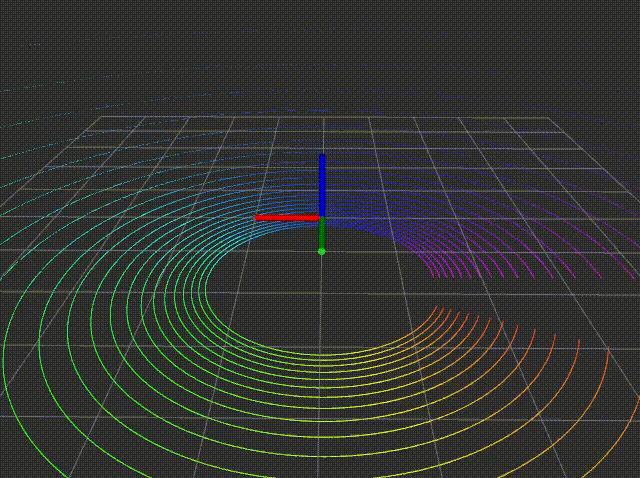

#Cube Sim
a gazebo simulation using a spinning multi-beam lidar

## Setup
Execute
```
source setup.bash
```
to build the library and setup environment variable.
## Run
In the same terminal executing `setup`, execute
```
rosrun gazebo_ros gazebo $PATH_TO_PROJECT/cube_sim.world
```
which will publish `sensor_msgs/PointCloud2` message with `velodyne_points` topic name.

## 
